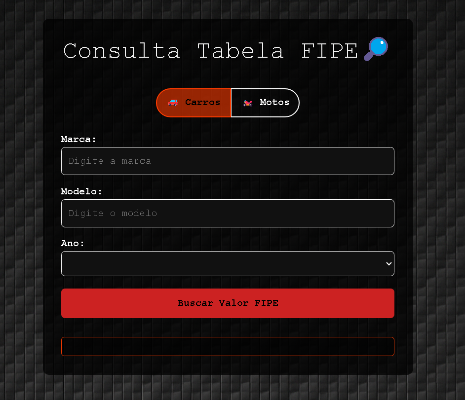

# 🚗 Projeto Consulta Tabela FIPE

Este é um projeto web interativo que permite aos usuários **consultar o valor de mercado de veículos** (carros ou motos) com base na **Tabela FIPE**. A aplicação utiliza **HTML, CSS e JavaScript** e consome a [API pública da Tabela FIPE](https://deividfortuna.github.io/fipe/).

## 🎯 Objetivo do Projeto

O objetivo é facilitar a pesquisa de preços de veículos por meio de uma interface limpa e intuitiva, oferecendo uma experiência rápida para o usuário. Ideal para quem deseja consultar valores antes de comprar ou vender um veículo.

## 🧩 Funcionalidades

- 🔍 Escolha do tipo de veículo (carro ou moto)
- 🚙 Listagem de marcas, modelos e anos diretamente da API
- 💰 Exibição do valor de mercado atual do veículo
- 🔁 Interface dinâmica com carregamento automático dos dados conforme a seleção do usuário
- 🖥️ Responsividade básica para diferentes tamanhos de tela

## 📸 Demonstração



## 🛠 Tecnologias Utilizadas

- **HTML5** – Estrutura da interface
- **CSS3** – Estilização dos elementos
- **JavaScript (Vanilla)** – Lógica, requisições assíncronas à API e manipulação do DOM
- **API Tabela FIPE** – Fornecimento dos dados em tempo real

## 🚀 Como Executar o Projeto

1. Clone este repositório:
   ```bash
   git clone https://github.com/soares2107/Projeto_Consulta_tabela_fipe.git
   ```

2. Acesse a pasta do projeto:
   ```bash
   cd Projeto_Consulta_tabela_fipe
   ```

3. Abra o arquivo `index.html` em seu navegador.

## 🗃️ Estrutura de Arquivos

```
Projeto_Consulta_tabela_fipe/
├── index.html           # Página principal
├── style.css            # Estilos da aplicação
├── script.js            # Lógica da aplicação e integração com a API
└── img/
    └── print.png # Imagem ilustrativa da aplicação
    └──fibra.png  #Fundo de tela
```

## 📌 Observações

- O projeto utiliza a API não oficial da Tabela FIPE disponibilizada por Deivid Fortuna.
- É necessário estar conectado à internet para que as requisições funcionem corretamente.

## 📄 Licença

Este projeto está sob a licença **MIT**. Consulte o arquivo [LICENSE](LICENSE) para mais detalhes.
